<p align="center">
  
</p>

## C++20 CSV data reader and small csv kit
*    About
*    [FAQ](#faq)
*    [Features](#features)
*    [Minimum Supported Compilers](#minimum-supported-compilers)
*    [Acknowledgments](#acknowledgments)
*    [Example](#example)
*    [API](#api)
*    [Problems and Suggestions](#problems-and-suggestions)
*    [Benchmarks](#benchmarks)
*    [Small csv kit](#small-csv-kit)
*    [Statistics performance](#statistics-performance)
*    [Build All](#build-all)


### About
CSV_co is a lightweight and fast CSV data reader written in C++, driven by C++20 coroutines and having an alternative
tiny user API. Hope, it is in line with standard RFC 4180, because it was conceived to handle with field selection
carefully. The following requirements are satisfied:

- Windows and Unix style line endings.
- Optional header line.
- Each row (record) must contain the same number of fields.
- A field **can** be enclosed in double quotes.
- If a field contains commas, line breaks, double quotes, then this field **must** be enclosed in double quotes.
- The double-quotes character in the field must be doubled.
- Extension: partly double-quoted fields (non-quoted string fields with arbitrarily double-quoted parts)

Small csvkit is an attempt to do a shortened Python's csvkit. See [Small csv kit](#small-csv-kit) for more info.

### FAQ

> Why another parser?

Wanted to create a simplified RFC-4180-compliant parser that would be quite fast, with minimal clear code and user level originality.

> How fast is it?

Just look at [Benchmarks](#benchmarks) and (if you would like to use small csvkit) look at
[Statistics performance](#statistics-performance) and [Sorting performance](#sorting-performance).


### Features
- Memory-mapping CSV files.
- Several CSV data sources.
- Two modes of iteration (for fields and for rows).
- Callbacks for each field or each row (header's or value).
- Callbacks for changing rows.
- Implicit casts to string type.
- Explicit casts to arithmetic types.
- Fast integral, float and double casts everywhere.
- Fast long double casts where available (in MSVC).
- Strongly typed (concept-based) reader's template parameters.
- Transparent UTF-8 support.
- Tested and benchmarked.

### Minimum Supported Compilers
- Linux
  - GNU GCC 10.2 C++ compiler
  - LLVM Clang 15.0 C++ compiler
- Windows
  - Cygwin with GCC 10.2 C++ compiler
  - Microsoft Visual Studio (most recent for small csv kit and 2019 Update 9 (16.9.4) for csv data reader class)
  - MinGW with GCC 10.2 C++ compiler

### Acknowledgments
To Andreas Fertig for C++20 coroutine tutorials and code which were highly borrowed.

### Example

General scheme:
```cpp
#include <csv_co/reader.hpp>

using namespace csv_co;
using reader_type = reader< trimming_policy >;

reader_type r( CSV_source );
r.run_spans([](auto s) {
    // do something with each next field's span
});
```

Spans iteration mode, save all fields to a container and view the data:

```cpp
try {
    reader_type r(std::filesystem::path("smallpop.csv"));
    std::vector<decltype(r)::cell_span> ram;
    ram.reserve(r.cols() * r.rows());
    r.validate().run_spans( // check validity and run
        [](auto) {
            // ignore header fields
        }
        ,[&ram](auto s) {
            // save value fields
            ram.emplace_back(s);
        });

    // population of Southborough,MA:
    std::cout << ram [0] << ',' << ram[1] << ':' << ram[3] << '\n';
} catch (reader_type::exception const & e) {
    std::cout << e.what() << '\n';
}
```

Spans iteration mode, use changing row callback to facilitate filling an MxN table:

```cpp
try {
    reader<trim_policy::alltrim> r (std::filesystem::path("smallpop.csv"));
    tableMxN table(r);

    auto c_row {-1}; // will be incremented automatically
    auto c_col {0u};

    // ignore header fields, obtain value fields, and trace rows:
    r.run_spans(
        [](auto) {}
        ,[&](auto s){ table[c_row][c_col++] = s; } 
        ,[&]{ c_row++; c_col = 0; }
    );

    // population of Southborough,MA
    std::cout << table[0][0] << ',' << table[0][1] << ':' << table[0][3] << '\n';
} catch (reader_type::exception const & e) {/* handler */}
```

Rows iteration mode.
Here is, for example, how to calculate the population (if reported) in the state of CA where the latitude is less than
34.0.

```cpp
...
using reader_type = reader<trim_policy::alltrim>;

auto sum = 0u;
reader_type r(std::filesystem::path("uspop.csv"));
r.validate().run_rows(
    [](auto){} // skip header line
    ,[&sum](reader_type::row_span rs) {
        if (rs["State"]=="CA" and !rs["Population"].empty() and rs["Latitude"].as<float>() < 34.0) {
            sum += rs["Population"].as<unsigned>();
        }
    }
);
...
```

And the last use case is string CSV source:

```cpp
reader (R"("William said: ""I am going home, but someone always bothers me""","Movie ""Falling down""")")
    .run_spans([](auto s) {
        assert(
            s == R"(William said: "I am going home, but someone always bothers me")"
            || s == R"(Movie "Falling down")"
        );
    });
```

### API

Public API available:

```cpp
using cell_string = std::basic_string<char, std::char_traits<char>, allocator<char>>;
    
template <TrimPolicyConcept TrimPolicy = trim_policy::no_trimming
         , QuoteConcept Quote = double_quotes
         , DelimiterConcept Delimiter = comma_delimiter
         , LineBreakConcept LineBreak = non_mac_ln_brk
         , MaxFieldSizePolicyConcept MaxFieldSize = MFS::no_trace
         , EmptyRowsPolicyConcept EmptyRows = ER::std_4180>
class reader final : auxiliary_classes {
public:
    // Constructors
    explicit reader(std::filesystem::path const &);
    explicit reader(std::string);
    explicit reader(const char *);
    template <typename MatrixContainer>
    explicit reader (MatrixContainer const &);

    // csv_co::reader is movable type
    reader (reader && other) noexcept = default;
    auto operator=(reader && other) noexcept -> reader & = default;

    // Notification
    auto & install_notification_handler(notification_cb_t);

    // Validation
    template <std::size_t ChunkSize=default_chunk_size>
    [[nodiscard]] auto validate() -> reader&;

    // Shape
    template <std::size_t ParseChunkSize=default_chunk_size>
    [[nodiscard]] auto cols() noexcept (max_field_size_no_trace) -> std::size_t;
    template <std::size_t ParseChunkSize=default_chunk_size>
    [[nodiscard]] auto rows() noexcept -> std::size_t requires (std::is_same_v<EmptyRows, ER::std_4180>);
    [[nodiscard]] auto validated_cols() const -> std::size_t;
    [[nodiscard]] auto validated_rows() const -> std::size_t;
    
    // Parsing
    template <std::size_t ParseChunkSize=default_chunk_size>
    void run_spans(value_field_span_cb_t, new_row_cb_t n=[]{});
    template <std::size_t ParseChunkSize=default_chunk_size>
    void run_spans(header_field_span_cb_t, value_field_span_cb_t, new_row_cb_t value = []{});
    template <std::size_t ParseChunkSize=default_chunk_size>
    void run_rows(value_row_span_cb_t);
    template <std::size_t ParseChunkSize=default_chunk_size>
    void run_rows(header_row_span_cb_t, value_row_span_cb_t);

    // Seeking, Skipping empty lines or copyrights
    template <std::size_t ParseChunkSize=default_chunk_size>
    void seek() requires (std::is_same_v<EmptyRows, ER::std_4180>);
    template <std::size_t ParseChunkSize=default_chunk_size>
    auto skip_rows(std::size_t) -> reader&;

    // Header row fields helper
    template <typename Container=std::vector<cell_span>, std::size_t ParseChunkSize=default_chunk_size>
    Container header() requires has_emplace_back<Container>;

    // Reading fields' values within callbacks
    class cell_span {
    public:
        cell_span() = default;
        cell_span(cell_string::const_pointer begin, cell_string::const_pointer end) noexcept;
        cell_span(cell_string::const_iterator const & begin, cell_string::const_iterator const & end) noexcept;
        explicit cell_span(cell_string const &) noexcept;

        // Implicit conversion to strings
        operator cell_string () const;
        operator unquoted_cell_string() const;

        // Explicit conversion
        template <typename T>
        T as() const requires std::is_arithmetic_v<T>;
        // Explicit unmodified conversion to string
        [[nodiscard]] cell_string raw_string() const;
        // Explicit unmodified conversion to string_view
        [[nodiscard]] std::string_view raw_string_view() const;

        // Useful helpers

        // Lexicographical underlying string comparisons
        // C-string strcmp()-like (1,0,-1), quoted std::string comparison.
        [[nodiscard]] auto compare(cell_span const &other) const -> int;
        // span to string comparison
        bool operator== (cell_string const & cs) const noexcept;
        // span to a numeric value comparison
        template <typename T>
        constexpr bool operator==(T other) const requires std::is_arithmetic_v<T>;
        // used for precision evaluation
        template <typename T>
        constexpr T operator-(T other) const requires std::is_floating_point_v<T>;
        // emptiness
        [[nodiscard]] bool empty() const;
        // length
        [[nodiscard]] size_t size() const;
    };

    struct row_span : protected std::span<cell_span> {
        using std::span<cell_span>::operator[];
        using std::span<cell_span>::front;
        using std::span<cell_span>::back;
        using std::span<cell_span>::begin;
        using std::span<cell_span>::end;

        template<typename It>
        row_span(It first, size_t columns) noexcept(noexcept(std::span<cell_span>(first, columns))); 

        cell_span const & operator[](const cell_string &) const noexcept;
        friend std::ostream & operator<<(std::ostream &, row_span const &);
    };

    // Callback types
    using header_field_span_cb_t = std::function<void(cell_span & span)>;
    using value_field_span_cb_t = std::function<void(cell_span & span)>;
    using new_row_cb_t = std::function<void()>;

    using header_row_span_cb_t = std::function<void(row_span & span)>;
    using value_row_span_cb_t = std::function<void(row_span & span)>;

    // Exception and helpful exception types
    struct exception : std::runtime_error {
        // Constructor
        template <typename ... Types>
        explicit constexpr exception(Types ... args);

        [[nodiscard]] constexpr auto what() const noexcept -> char const* override;
    };
    struct implementation_exception : exception;

    // Bridge between CSV reader and CSV kit
    template <bool Unquoted>
    class typed_span : protected cell_span {
        ...   
    };
};
```

### Problems and Suggestions

MSVC's executable has a performance drawdown of about 200-300% compared to Linux/Clang. I haven't profiled the code
enough yet. So, if you know how to adjust the performance in this particular case: patch (or code rewrite) is welcomed.  
As to GCC: if you notice an essential performance drawdown, just use a recent compiler. 

### Benchmarks

Benchmarking sources are in `benchmark` folder. Two of them measure, in spans iteration mode and in rows iteration mode,
the average execution times (after a warmup run) for `CSV_co` to memory-map the input CSV file and iterate over every
field in it.

_(Clang)_
```bash
cd benchmark
clang++ -I../include -Ofast -march=native -std=c++20 ./rowsbench.cpp
watch -n 1 ./a.out ./flights.csv
cd ..
```

_(GCC)_
```bash
cd benchmark
g++ -I../include -Ofast -march=native -std=c++20  -fcoroutines  ./spanbench.cpp
watch -n 1 ./a.out ./worldcitiespop.csv
cd ..
```

#### System Details

| Type          | Value                                           |
|---------------|-------------------------------------------------|
| Processor     | Intel(R) Core(TM) i7-6700 CPU @ 3.40 GHz        |
| Installed RAM | 16 GB                                           |
| HDD/SSD       | USB hard drive                                  |
| OS            | Linux slax 5.10.92 (Debian Linux 11 (bullseye)) |
| C++ Compiler  | Clang 15.0.6                                    |

#### Results (spans)

| Old or New Popular Dataset                                                                  | File Size | Rows       | Cols | Cells       | Time   | Bandwidth |
|---------------------------------------------------------------------------------------------|-----------|------------|------|-------------|--------|-----------|
| Benchmark folder's game.csv                                                                 | 2.6M      | 100'000    | 6    | 600'000     | 0.003s | 866 MBps  |
| [2015_StateDepartment.csv](https://github.com/vincentlaucsb/csv-data/tree/master/real_data) | 70M       | 246'498    | 28   | 6'901944    | 0.075s | 933 MBps  |
| [Denver Crime Data](https://www.kaggle.com/paultimothymooney/denver-crime-data)             | 102M      | 399'573    | 20   | 7'991'460   | 0.106s | 962 MBps  |
| [worldcitiespop.csv](http://burntsushi.net/stuff/worldcitiespop.csv.gz)                     | 145M      | 3'173'959  | 7    | 22'217'713  | 0.187s | 775 MBps  |
| [2015 Flight Delays and Cancellations](https://www.kaggle.com/usdot/flight-delays)          | 565M      | 5'819'080  | 31   | 180'391'480 | 0.860s | 657 MBps  |
| [StackLite: Stack Overflow questions](https://www.kaggle.com/stackoverflow/stackite)        | 844M      | 50'576'843 | 2    | 101'153'686 | 1.310s | 644 MBps  |


#### Results (rows+spans iteration within a row)

| Old or New Popular Dataset                                                                  | File Size | Rows       | Cols | Cells       | Time   | Bandwidth |
|---------------------------------------------------------------------------------------------|-----------|------------|------|-------------|--------|-----------|
| Benchmark folder's game.csv                                                                 | 2.6M      | 100'000    | 6    | 600'000     | 0.002s | 1300 Mbps |
| [2015_StateDepartment.csv](https://github.com/vincentlaucsb/csv-data/tree/master/real_data) | 70M       | 246'498    | 28   | 6'901944    | 0.061s | 1147 Mbps |
| [Denver Crime Data](https://www.kaggle.com/paultimothymooney/denver-crime-data)             | 102M      | 399'573    | 20   | 7'991'460   | 0.091s | 1120 MBps |
| [worldcitiespop.csv](http://burntsushi.net/stuff/worldcitiespop.csv.gz)                     | 145M      | 3'173'959  | 7    | 22'217'713  | 0.154s | 941  MBps |
| [2015 Flight Delays and Cancellations](https://www.kaggle.com/usdot/flight-delays)          | 565M      | 5'819'080  | 31   | 180'391'480 | 0.583s | 969  MBps |
| [StackLite: Stack Overflow questions](https://www.kaggle.com/stackoverflow/stackite)        | 844M      | 50'576'843 | 2    | 101'153'686 | 1.177s | 717  MBps |

The drop in Bandwidth is, in the limit, proportional to the file size. This is not surprising, since pumping data into caches of different levels is gradually 
becoming a prevalent operation, which in itself is slow.

### Small csv kit

Shortly: Small csv kit is shortened Python's csvkit with the speed of Rust's xsv (and even faster). It is written on top of the
csv_co "parse engine" and, where needed, with the help of task-based parallelism library transwarp. It tries to reproduce the
functionality of the csvkit whenever possible.

<h4>Note: small csv kit is in an early development stage and with code needing some revision. But it is already usable. 
Bug reports, scenarios that failed and so on are very welcome.</h4>  

The goals for the reproduction were: to find out the complexity and limitations of the applicability of the C++ ecosystem for broad
universal tasks, where Python is good with its rich environment for data processing, encoding, localization, and so on. It was also
interesting to see the performance benefits of C++ applications in non-traditional areas.  
These utilities are currently implemented: csvclean, csvcut, csvgrep, csvjoin, csvjson, csvlook, csvsort, csvstack, csvstat. 

#### Restrictions:  

1) Things not implemented for now: in2csv, sql2csv, csvformat, csvpy, csvsql.

2) Due to the fact that csv_co engine only supports RFC 4180, the following utility arguments are missing:
	- <i>-d DELIMITER, --delimiter DELIMITER</i>  
	- <i>-t, --tabs</i>   
	- <i>-q QUOTECHAR, --quotechar QUOTECHAR</i>    
	- <i>-u {0,1,2,3}, --quoting {0,1,2,3}</i>  
	- <i>-b, --no-doublequote</i>  
	- <i>-y SNIFF_LIMIT, --snifflimit SNIFF_LIMIT</i>  
	The remaining arguments must be present. Another thing is that they may accidentally remain unrealized at the moment.
        When running, any utility tries to quickly check the equality of columns in your documents to match RFC 4180.
        To ensure a document is valid there is special csvclean utility in csvkit and in here. 

3) When handling date and datetime data types and their localization, csvkit relies on the rich Python datetime library. It also
allows you to work with time representations such as 'yesterday', 'today', 'tomorrow', and so on. However, our tool in this sense
is tightly bound to the --date-format and --datetime-format arguments and works well only on those platforms where this is
supported by the environment/compiler/standard library. And the --date-lib-parser argument engages the special date library to
improve the situation and ensure consistency everywhere. For more info see tests located in csvkit_core_test.cpp.

4) Some utilities may not support composition/piping.
5) csvjson does not support geometry option for right now. 

### Statistics performance
There were measured the performances of three tools: [csvkit(1.5.0)'s csvstat](https://pypi.org/project/csvkit/), 
[xsv(0.13.0)' stats](https://github.com/BurntSushi/xsv/releases/tag/0.13.0) and this one (csv_co's csvstat) at files: 
crime.csv, worldcitiespop.csv, flights.csv and question_tags.csv with (or with no) a limited number of columns
(so as not to break up screenshots). Here are the results (csvkit, xsv, and this tool screenshots):  

<h3>(crime.csv)(csvkit)</h3> 
 
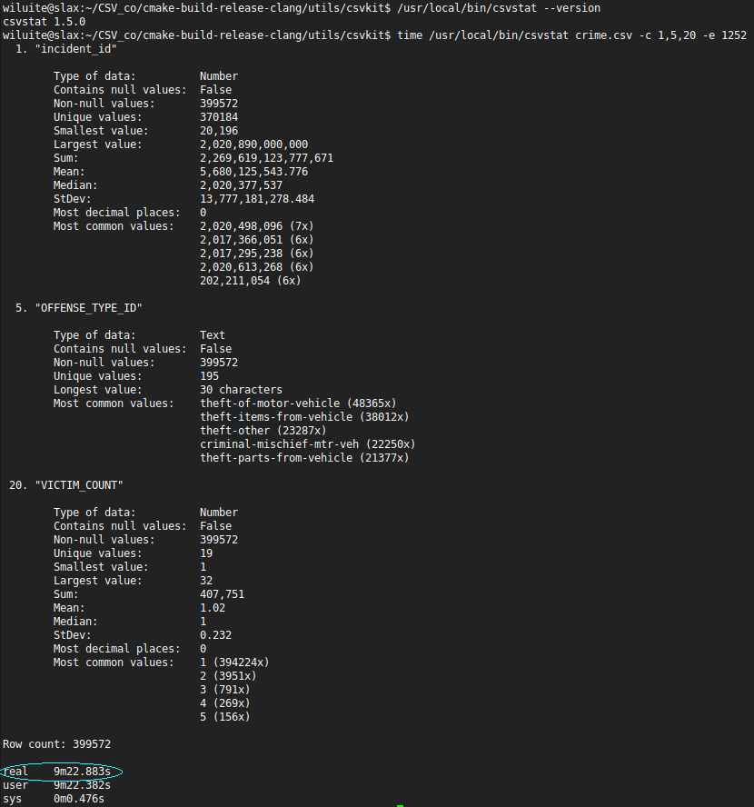 
-
<h3>(crime.csv)(xsv)</h3>  

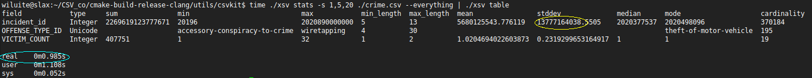 
-
<h3>(crime.csv)(this tool)</h3>
  
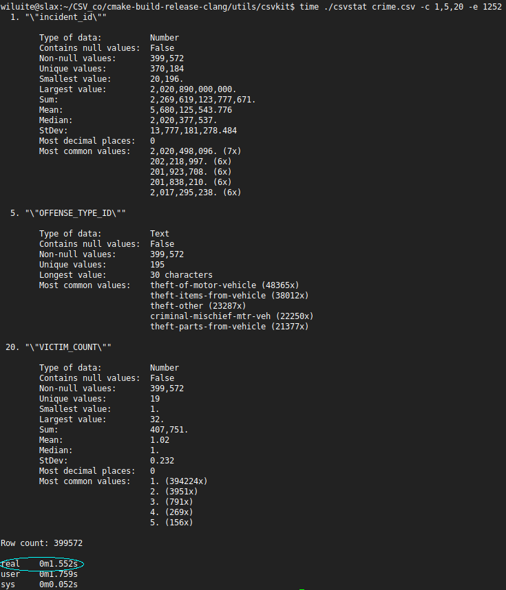 

Here, xsv is the winner. It produces results in less than a second.  
The peculiarity of this file is that it is not utf8-encoded and that its fields are heavily quoted.  

<h3>(worldcitiespop.csv)(csvkit)</h3>

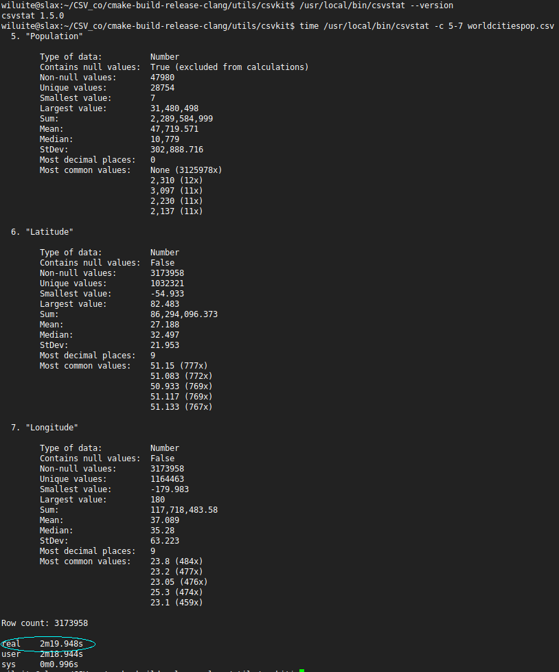
-
<h3>(worldcitiespop.csv)(xsv)</h3>

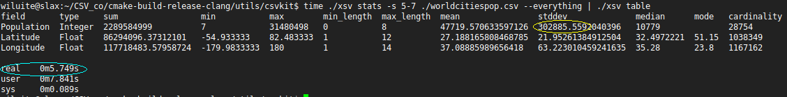
-
<h3>(worldcitiespop.csv)(this tool)</h3>

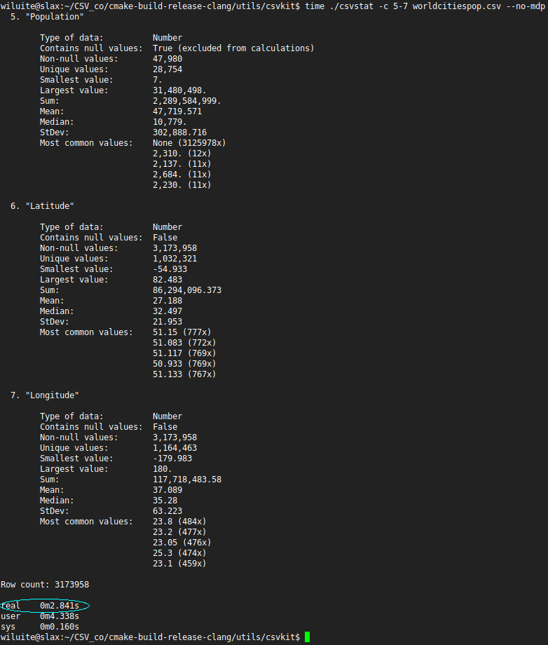

Here, this tool is even faster. 
Note: since xsv does not calculate 'most decimal places' in its statistics, unlike csvkit, we have disabled this time-consuming 
option at ours.

<h3>(flights.csv)(csvkit)</h3>

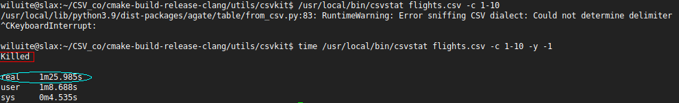
-
<h3>(flights.csv)(xsv)</h3>

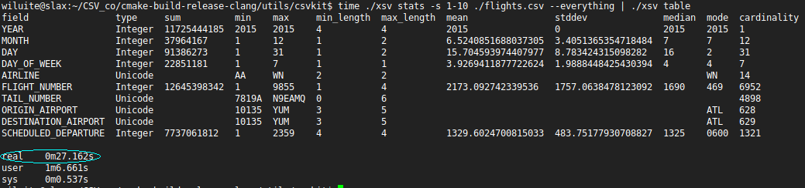
-
<h3>(flights.csv)(this tool)</h3>

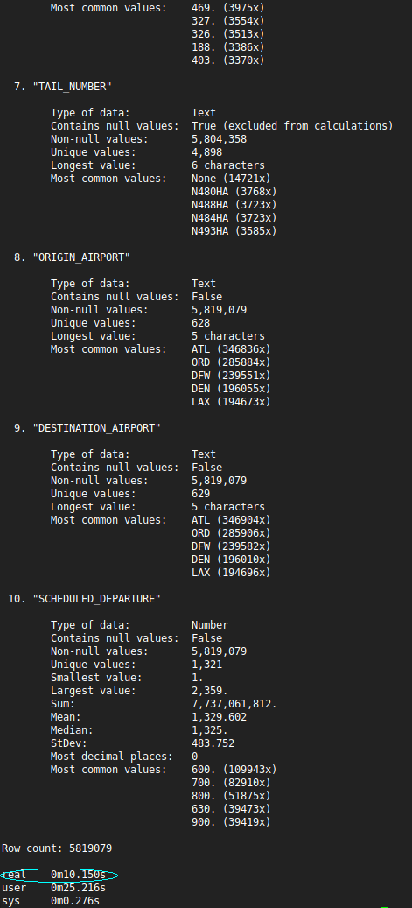

Here we again beat xsv by more than 2 times by doing statistics on the first 10 columns.
If we did full statistics on all columns, xsv would run out of memory on our current machine (now we had 12 GB RAM), 
as in the following test.

<h3>(question_tags.csv)(xsv)</h3>

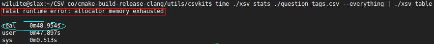
-
<h3>(question_tags.csv)(this tool)</h3>

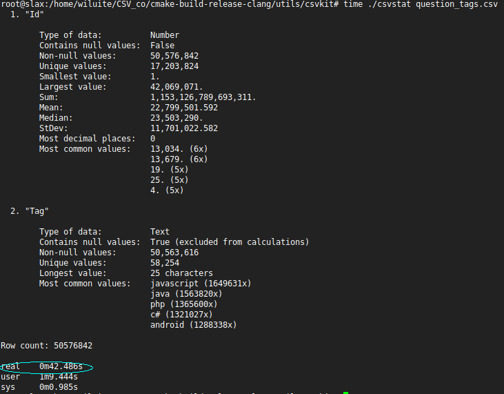

Our tool gives the result in about 42 seconds. Here we could not wait for the result from csvkit within a reasonable time. 
Thus, both csvkit and xsv are unable to produce their results where for csv_co' csvstat the reasons why this is not possible 
are not the case. This is a subject for further research.

### Sorting performance
If we talk about sorting by columns of string types, then the xsv is unrivaled, far ahead of other means in time, because
it obviously uses efficient algorithms for sorting strings, and without the use of parallelism. However, let's see how
effective it is to sort a group of columns where there is one numeric type (the -N option is required, otherwise the
results will be incorrect). We only need about 7 seconds versus 21 at the xsv. The csvkit is more than a minute behind us.
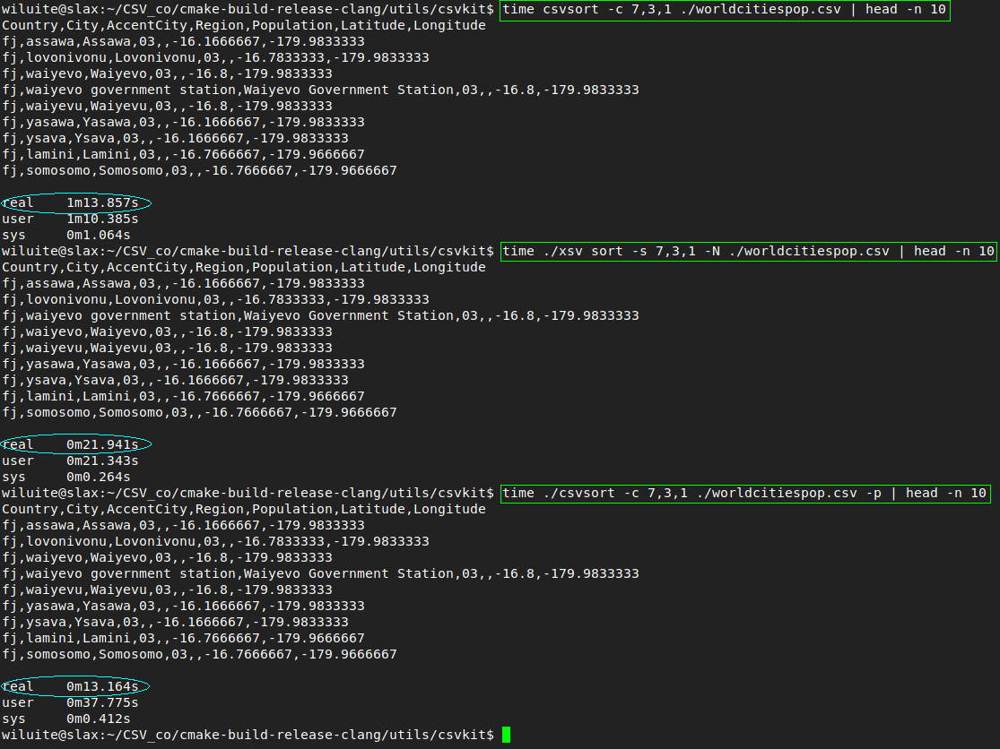

### Build All

<h4>Note. For now, you need Python installed. This is to configure one of libraries used. Over time, this dependence will be removed.</h4>

_Conventional:_
```bash
mkdir build && cd build
cmake ..
make -j 4
```

_Better (if you have clang, libc++-dev, libc++abi-dev packages or their analogs installed):_
```bash
mkdir build && cd build
cmake -DCMAKE_CXX_COMPILER=clang++ -D_STDLIB_LIBCPP=ON ..
make -j 4
```

_Best (if you simply have got clang):_
```bash
mkdir build && cd build
cmake -DCMAKE_CXX_COMPILER=clang++ -D_STDLIB_LIBCPP=OFF ..
make -j 4
```

_Check for memory safety (if you have clang sanitizers packages installed):_
```bash
mkdir build && cd build
cmake -DCMAKE_CXX_COMPILER=clang++ -D_SANITY_CHECK=ON -DCMAKE_BUILD_TYPE=Debug ..
make -j 4
```

_MSVC (in x64 Native Tools Command Prompt):_  
```bash
mkdir build && cd build
cmake -G "Visual Studio 17 2022" -DCMAKE_BUILD_TYPE=Release ..
msbuild /property:Configuration=Release csv_co.sln
```
_Running tests in MSVC:_
```bash
cd build/test
```
_Then, run all tests:_
```bash
ctest.exe -j 6 
```
_Or run a particular test (still staying in the test directory):_
```bash
Release/test.exe
```
NOTE! The code for the **csvjoin** and the **csvjson** utilities is currently very problematic for
the Microsoft Compilers of certain versions. So, for now, those utilities are made not fully
functional here. ;-(
